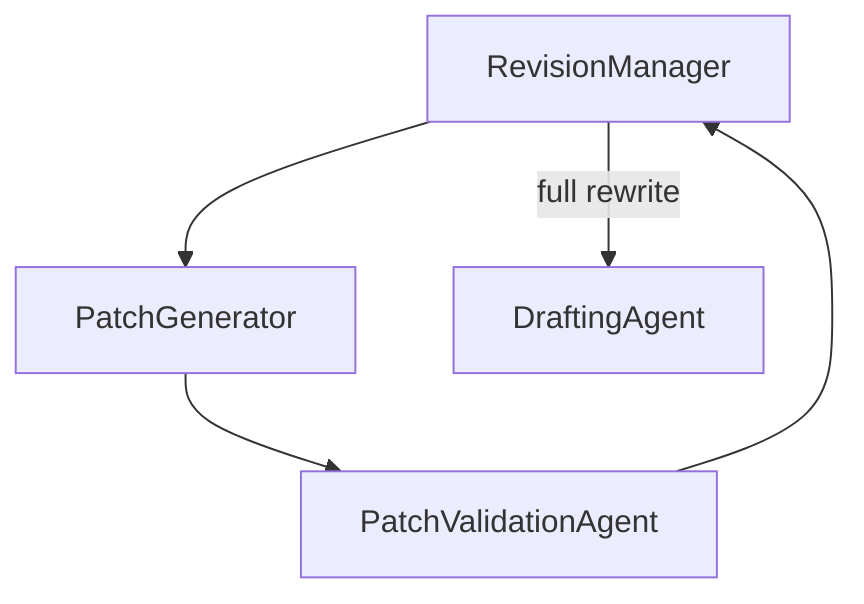

# SAGA: Semantic And Graph-enhanced Authoring 🌌📚
## Let NANA (Next-gen Autonomous Narrative Architecture) tell you a story, just like old times!

[](https://opensource.org/licenses/Apache-2.0)

SAGA is an autonomous, agentic creative-writing system designed to generate entire novels. Powered by the **NANA** engine, SAGA leverages Large Language Models (LLMs), a sophisticated understanding of narrative context through embeddings, and a Neo4j graph database to create rich, coherent, and evolving narratives.

### Progress Window
*(This is a representation of the Rich CLI progress window)*


### Example Knowledge Graph Visualization (9 Chapters)


### Example Knowledge Graph Visualization (18 Chapters)


## Overview

SAGA, with its NANA engine, is an ambitious project designed to autonomously craft entire novels. It transcends simple text generation by employing a collaborative team of specialized AI agents:

*   **`agents.PlannerAgent`:** Strategically outlines detailed scene-by-scene plans for each chapter, ensuring plot progression and incorporating directorial elements like pacing and scene type.
*   **`agents.DraftingAgent`:** Weaves the initial prose for chapters, guided by the planner's blueprints and rich contextual information. It can operate scene-by-scene or draft a whole chapter in a single pass.
*   **`agents.ComprehensiveEvaluatorAgent`:** Critically assesses drafts for plot coherence, thematic alignment, character consistency, narrative depth, and overall quality, generating structured `ProblemDetail` feedback.
*   **`processing.revision_manager.RevisionManager`:** Coordinates revisions based on evaluation feedback, orchestrating patch-based fixes or full chapter rewrites.
*   **`agents.PatchValidationAgent`:** Verifies generated patch instructions to ensure they resolve the identified problems before being applied.
*   **`agents.KGMaintainerAgent`:** Intelligently manages the novel's evolving knowledge graph in Neo4j. It summarizes chapters, extracts new knowledge from final text, and performs periodic "healing" cycles to resolve duplicates and enrich sparse data.
*   **`agents.FinalizeAgent`:** Orchestrates the final steps for a chapter, including KG updates, text summarization, embedding generation, and persisting all data to the database.
*   **Core Utilities:** Shared database (`core.db_manager`) and LLM (`core.llm_interface`) helpers provide robust, reusable infrastructure for all agents.

SAGA constructs a dynamic, interconnected understanding of the story's world, characters, and plot. This evolving knowledge, stored and queried from a Neo4j graph database, enables the system to maintain greater consistency, depth, and narrative cohesion as the story unfolds over many chapters.

## Key Features

*   **Autonomous Multi-Chapter Novel Generation:** Capable of generating batches of chapters (e.g., 3 chapters in ~11 minutes) in a single run, producing substantial narrative content (e.g., ~13K+ tokens per chapter).
*   **Sophisticated Agentic Architecture:** Utilizes a suite of specialized AI agents, each responsible for distinct phases of the creative writing pipeline, orchestrated by `orchestration.nana_orchestrator`.
*   **Deep Knowledge Graph Integration (Neo4j):**
    *   Persistently stores and retrieves story canon, character profiles (including development over time), detailed world-building elements, and plot points via a dedicated `data_access` layer.
    *   Features a robust, predefined schema with constraints and a vector index for semantic search, automatically created on first run.
    *   Supports complex queries for consistency checking, context retrieval, and graph maintenance.
*   **Hybrid Semantic & Factual Context Generation:**
    *   Leverages text embeddings (via Ollama) and Neo4j vector similarity search to construct semantically relevant context from previous chapters, ensuring narrative flow and tone.
    *   Integrates key factual data extracted from the Knowledge Graph to ground the LLM in established canon.
*   **Iterative Drafting, Evaluation, & Revision Cycle:** Chapters undergo a rigorous process of drafting, multi-faceted evaluation, and intelligent revision (patch-based or full rewrite) to enhance quality and coherence.
*   **Dynamic Knowledge Graph Updates & Healing:** The system "learns" from generated content. The `KGMaintainerAgent` extracts new information (character updates, world-building changes, KG triples) from final chapter text and performs periodic maintenance to resolve duplicate entities, promote dynamic relationships, deduplicate them, and enrich "thin" nodes. Entity names are normalized before ID creation, stripping leading articles ("the", "a", "an") so that "The Wilderness" and "Wilderness" refer to the same node.
*   **Provisional Data Handling:** Explicitly tracks and manages the provisional status of data derived from unrevised or flawed drafts, ensuring a distinction between canonical and tentative information in the knowledge graph.
*   **Flexible Configuration (`config.py` & `.env`):**
    *   Extensive options for LLM endpoints, model selection per task, API keys, Neo4j connection details, generation parameters, and more, managed by Pydantic.
    *   Supports "Unhinged Mode" for highly randomized and surprising initial story elements if user input is minimal.
*   **User-Driven Initialization:** Accepts user-supplied story elements via a `user_story_elements.yaml` file, allowing for a customized starting point. The `[Fill-in]` placeholder system allows users to specify which elements SAGA should generate.
*   **Rich Console Progress Display:** Optional live progress updates using the Rich library, providing a clear view of the generation process.
*   **Text De-duplication:** Implements mechanisms to reduce repetitive content in generated drafts using both string and semantic comparisons.

## Architecture & Pipeline

SAGA's NANA engine orchestrates a sophisticated pipeline for novel generation:

1.  **Initialization & Setup (First Run or Reset):**
    *   **Connect & Verify Neo4j:** Establishes connection and ensures the database schema (indexes, constraints, vector index) is in place via `core.db_manager`.
    *   **Load Existing State (if any):** Attempts to load the plot outline and chapter count from Neo4j using the `data_access` layer.
    *   **Initial Story Generation (`initialization.genesis`):**
        *   If `user_story_elements.yaml` is provided, it's parsed to bootstrap the plot, characters, and world.
        *   Otherwise, or if key elements are marked `[Fill-in]`, the `bootstrapper` modules fill in the plot outline, character profiles, and world-building details via targeted LLM calls.
        *   The results are returned as typed models: `PlotOutline`, `CharacterProfile`, and `WorldBuilding` defined in `initialization.models`.
    *   **KG Pre-population:** The `KGMaintainerAgent` performs a full sync of this foundational story data to the Neo4j graph.
    *   **Initial Context Computation:** Once bootstrapping is complete, SAGA generates a baseline hybrid context from the newly populated KG. This context is stored and used to seed the prerequisites step for Chapter&nbsp;1.
    *   **Reset Neo4j:** To restart from a clean slate, stop the container with `docker-compose down -v` or run `python reset_neo4j.py --force` and then re-run `docker-compose up -d neo4j`.

2.  **Chapter Generation Loop (up to `CHAPTERS_PER_RUN` chapters):**
    *   **(A) Prerequisites (`orchestration.chapter_flow`):**
        *   Retrieves the current **Plot Point Focus** for the chapter.
        *   **Planning (if enabled):** The `PlannerAgent` creates a detailed scene-by-scene plan.
        *   **Context Generation:** `chapter_generation.context_orchestrator.ContextOrchestrator` assembles a "hybrid context" string by:
            *   Querying Neo4j for semantically similar past chapter summaries/text snippets (vector search).
            *   Fetching key reliable facts from the Knowledge Graph via context providers.
    *   **(B) Drafting:**
        *   The `DraftingAgent` writes the initial draft, guided by the scene plan (if available), plot point focus, and hybrid context.
    *   **(C) De-duplication & Evaluation:**
        *   The draft undergoes de-duplication via `processing.text_deduplicator` to reduce repetitiveness.
        *   The `ComprehensiveEvaluatorAgent` evaluates the draft against multiple criteria, including world continuity.
    *   **(D) Revision (if `needs_revision` is true):**
        *   `processing.revision_manager.RevisionManager` attempts to fix identified issues.
        *   If `ENABLE_PATCH_BASED_REVISION` is true, it generates and applies targeted text patches. A patch suggesting deletion is now handled as an empty string replacement.
        *   If patching is insufficient or disabled, or problems are extensive, a full chapter rewrite may be performed.
        *   The evaluation steps are repeated on the revised text.
    *   **(E) Finalization & Knowledge Update:**
        *   The `FinalizeAgent` takes over, using the `KGMaintainerAgent`.
        *   It summarizes the final approved chapter text.
        *   It extracts new knowledge (character updates, world-building changes, new KG triples) from the final chapter text and merges these updates into the in-memory state and persists them to Neo4j.
        *   It generates an embedding for the final chapter text.
        *   The final chapter data (text, summary, embedding, provisional status) is saved to Neo4j by `data_access.chapter_queries`.
        *   These updates recalculate the hybrid context so that the next chapter begins its prerequisites phase with the most current information.
    *   **(F) KG Maintenance (Periodic):**
        *   Every `KG_HEALING_INTERVAL` chapters, the `KGMaintainerAgent.heal_and_enrich_kg()` method is called to perform maintenance like resolving duplicate entities.

## Revision Phase

The revision stage is coordinated by `processing.revision_manager.RevisionManager`.
It receives the draft text and `EvaluationResult` objects and chooses between
patch-based fixes or a full rewrite. Patching is handled by
`processing.patch_generator.PatchGenerator`, which groups related problems,
generates patch instructions, optionally validates them via the
`PatchValidationAgent`, and applies the changes. After patching, the chapter is
re-evaluated and may loop through additional revision cycles up to
`MAX_REVISION_CYCLES_PER_CHAPTER`.

### Full Revision Flow

1. **Collect Evaluations:** `RevisionManager` receives `EvaluationResult` objects
   along with the draft text.
2. **Generate Patch Instructions:** When `ENABLE_PATCH_BASED_REVISION` is
   enabled, related problems are grouped and sent to `PatchGenerator`. It tries
   up to `PATCH_GENERATION_ATTEMPTS` times to create a maximum of
   `MAX_PATCH_INSTRUCTIONS_TO_GENERATE` instructions.
3. **Validate Patches:** If `AGENT_ENABLE_PATCH_VALIDATION` is true, each
   instruction is verified by `PatchValidationAgent` before it is applied.
4. **Apply Patches:** Accepted patches modify the text. The chapter is then
   re-evaluated. If the remaining problems are at or below
   `POST_PATCH_PROBLEM_THRESHOLD` and the changes meet the
   `REVISION_SIMILARITY_ACCEPTANCE` requirement, the revision is accepted.
5. **Full Rewrite Trigger:** Patching may be skipped when disabled, when the
   draft is shorter than `MIN_ACCEPTABLE_DRAFT_LENGTH`, or when repeated cycles
   exceed `MAX_REVISION_CYCLES_PER_CHAPTER`. In these cases `RevisionManager`
   instructs the `DraftingAgent` to perform a complete rewrite.
6. **Knowledge Graph Healing:** When root cause analysis reveals conflicts with
   character profiles or world elements, the orchestrator now calls
   `KGMaintainerAgent.heal_and_enrich_kg()` before the next revision attempt.



### Configuration Highlights

Several options in `config.py` adjust revision behavior:

* `ENABLE_PATCH_BASED_REVISION` – enable/disable the patch workflow.
* `AGENT_ENABLE_PATCH_VALIDATION` – use the LLM-based validator before applying patches.
* `MAX_PATCH_INSTRUCTIONS_TO_GENERATE` and `PATCH_GENERATION_ATTEMPTS` – control how many patches are produced and how many attempts are made.
* `POST_PATCH_PROBLEM_THRESHOLD` – if remaining problems after patching are at or below this value, the patched text is accepted.
* `REVISION_SIMILARITY_ACCEPTANCE` – skip patches that are too similar to the original text.
* `MAX_REVISION_CYCLES_PER_CHAPTER` and `MIN_ACCEPTABLE_DRAFT_LENGTH` – govern full rewrite limits and minimum chapter length.

Refer to `config.py` for additional settings such as temperatures and penalty
values that further tune revision and patch prompts.

## Setup

### Prerequisites

*   Python 3.9+
*   An Ollama instance for generating text embeddings (e.g., running `ollama serve`).
*   An OpenAI-API compatible LLM server (e.g., running via LM Studio, oobabooga's text-generation-webui, or a local vLLM/TGI instance).
*   Neo4j Database (v5.x recommended for vector index support). Docker setup is provided.

### 1. Clone the Repository

```bash
git clone https://github.com/Lanerra/saga.git
cd saga
```

### 2. Install Python Dependencies

It's highly recommended to use a Python virtual environment:

```bash
python -m venv venv
source venv/bin/activate  # On Windows: venv\Scripts\activate
pip install -r requirements.txt
python -m spacy download en_core_web_sm
```

### 3. Configure SAGA

Core configuration is managed in `config.py`, which loads values from environment variables (e.g., from a `.env` file). Create a `.env` file in the root of the project.

**Key settings to configure in your `.env` file:**

```dotenv
# LLM API Configuration
OPENAI_API_BASE="http://127.0.0.1:8080/v1" # URL of your OpenAI-compatible LLM API
OPENAI_API_KEY="nope"                       # API key (can be any string if server doesn't require auth)

# Embedding Model (Ollama) Configuration
OLLAMA_EMBED_URL="http://127.0.0.1:11434"     # URL of your Ollama API
EMBEDDING_MODEL="nomic-embed-text:latest"   # Ensure this model is pulled in Ollama (ollama pull nomic-embed-text)
EXPECTED_EMBEDDING_DIM="768"                # Dimension of your embedding model (e.g., 768 for nomic-embed-text)
ENABLE_RERANKING="True"                     # Enable reranker step for vector search
RERANKER_MODEL="mxbai-rerank-large-v1:latest" # Reranker model used when ENABLE_RERANKING is True

# Neo4j Connection (Defaults usually work with the provided Docker setup)
NEO4J_URI="bolt://localhost:7687"
NEO4J_USER="neo4j"
NEO4J_PASSWORD="saga_password"
NEO4J_DATABASE="neo4j" # Or your specific database name if not default
NEO4J_VECTOR_DIMENSIONS="768"                # Dimensions of your vector index

# Model Aliases (Set to the names of models available on your OPENAI_API_BASE server)
LARGE_MODEL="Qwen3-14B-Q4"    # Used for Planning, Evaluation
MEDIUM_MODEL="Qwen3-8B-Q4"   # Used for KG updates, Patches, Initial Setup
SMALL_MODEL="Qwen3-4B-Q4"    # Used for Summaries
NARRATOR_MODEL="Qwen3-14B-Q4" # Used for Drafting and a full Revision

# Other important settings in config.py (review defaults)
# MAX_CONTEXT_TOKENS, CHAPTERS_PER_RUN, AGENT_LOG_LEVEL, etc.
```

Refer to `config.py` for a full list of configurable options and their defaults.

### 4. Set up Neo4j Database

SAGA uses Neo4j for its knowledge graph. A `docker-compose.yml` file is provided for easy setup.

*   **Ensure Docker and Docker Compose are installed.**
*   **APOC Plugin:** The compose file sets `NEO4J_PLUGINS=["apoc"]` so the APOC Extended plugin is downloaded automatically when the container starts. If you add this later, restart the container to trigger the download.
*   **Manage Neo4j container (from the project root directory):**
    *   **Start Neo4j:**
        ```bash
        docker-compose up -d neo4j
        ```
        Wait a minute or two for Neo4j to fully initialize. You can access the Neo4j Browser at `http://localhost:7474`. Login with the credentials you configured (default: `neo4j` / `saga_password`).
    *   **Stop Neo4j:**
        ```bash
        docker-compose down
        ```
    *   **View Logs:**
        ```bash
        docker-compose logs -f neo4j
        ```

The first time SAGA runs (`python main.py`), it will automatically attempt to create necessary constraints and indexes in Neo4j.

### 5. (Optional) Provide Initial Story Elements

To guide SAGA with your own story ideas, create a `user_story_elements.yaml` file in the project's root directory.
You can use `user_story_elements.yaml.example` as a template. The YAML can be simple or include nested fields like the `characters` section with supporting characters.
Use the `[Fill-in]` placeholder for any elements you want SAGA to generate. If this file is not present or empty, SAGA will generate these elements based on its configuration.

### 6. (Optional) Configure "Unhinged Mode" Data

For "Unhinged Mode" (which generates highly randomized initial story elements if no user input is provided), SAGA can use custom lists from JSON files in the `unhinged_data/` directory.

## Running SAGA

Once Neo4j is running and your configuration is set:

```bash
python main.py
```

*   **First Run:** SAGA will perform initial setup (plot, world, characters based on `user_story_elements.yaml` or generation) and pre-populate the Neo4j knowledge graph.
*   **Subsequent Runs:** It will load the existing state from Neo4j and continue generating chapters from where it left off.
*   The orchestrator recalculates pending plot points before each chapter and continues until none remain or `CHAPTERS_PER_RUN` chapters have been written.
*   Evaluation prompts now include only the active plot point and the next one to keep feedback focused.

Output files (chapters, logs, debug information) will be saved in the directory specified by `BASE_OUTPUT_DIR` (default: `novel_output`). This directory is ignored by Git to keep generated data out of version control.

**Performance Example:**
Using a local setup with the following GGUF models:
*   `LARGE_MODEL = Qwen3-14B-Q4`
*   `MEDIUM_MODEL = Qwen3-8B-Q4`
*   `SMALL_MODEL = Qwen3-4B-Q4`
*   `NARRATOR_MODEL = Qwen3-14B-Q4`

SAGA can generate a batch of **3 chapters** (each ~13,000+ tokens of narrative) in approximately **11 minutes**, involving significant processing for planning, context generation, evaluation, and knowledge graph updates.

### Ingestion Mode

To import existing text into the knowledge graph:

```bash
python main.py --ingest path/to/novel.txt
```

The text is split into pseudo-chapters and processed through the finalization pipeline. The knowledge graph heals every `KG_HEALING_INTERVAL` chapters during ingestion so later chapters see a deduplicated graph.

## Resetting the Database

To start SAGA from a completely fresh state:

**⚠️ WARNING: This will delete ALL data in the Neo4j database targeted by your configuration.**

1.  Ensure SAGA (`main.py`) is not running.
2.  **Recommended:** Stop the Neo4j Docker container and remove its data volume:
    ```bash
    docker-compose down -v # The -v flag removes the data volume
    ```
    Then restart it: `docker-compose up -d neo4j`
3.  Alternatively, to clear data *within* an existing Neo4j instance, run the `reset_neo4j.py` script (this will not be provided in the initial code but is a useful utility to have):
    ```bash
    # Assuming you create a reset_neo4j.py script
    python reset_neo4j.py --force
    ```

After resetting and ensuring Neo4j is running, the next execution of `python main.py` will re-initialize the story and KG.

## Complexity Analysis

You can check SAGA's cyclomatic complexity with [Radon](https://radon.readthedocs.io/en/latest/):

```bash
python complexity_report.py
```

This runs `radon cc . -nc` and highlights functions that may benefit from refactoring.

### Install Dev Dependencies

Install `ruff` and `mypy` in addition to the core requirements:

```bash
pip install -r requirements.txt  # installs pytest-cov for coverage
pip install ruff mypy
```

### Environment Variables

Use `.env.example` as a starting point:

```bash
cp .env.example .env
```

Two notable variables prefixed with `AGENT_` control behavior:

- `AGENT_LOG_LEVEL` – set log verbosity (e.g., `INFO` or `DEBUG`).
- `AGENT_ENABLE_PATCH_VALIDATION` – enable the `PatchValidationAgent` to verify patches.

### Running Linters and Tests

Check formatting and linting with Ruff, run type checks, and execute tests with coverage:

```bash
ruff check .
ruff format --check .
mypy .
pytest -v --cov=. --cov-report=term-missing
```

## License

This project is licensed under the Apache License, Version 2.0. See the `LICENSE` file for details.
